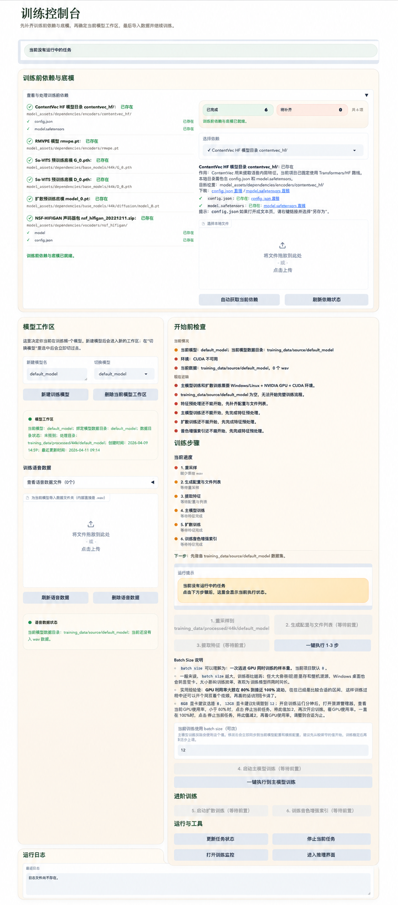
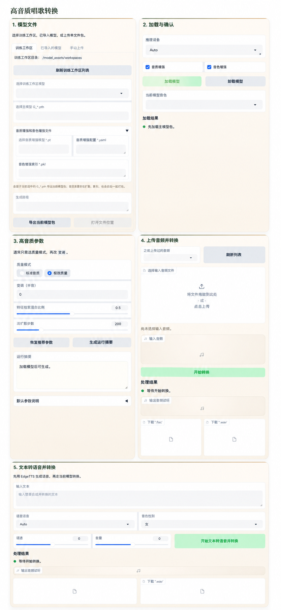

# SoftVC VITS Singing Voice Conversion

[English](./README_en.md) | [中文简体](./README.md)

[](./LICENSE)

这是一个本地离线的 So-VITS-SVC 改造版，当前目标是让用户通过可视化页面完成单说话人训练和高质量歌声音色转换。

## 使用声明

本项目仅供学习、研究和合法授权场景使用。

使用者需要自行确认训练数据、输入音频、模型发布和合成音频发布的授权。本仓库不提供任何模型，也不对用户训练模型或合成音频的用途负责。

禁止使用本项目从事违法、侵权、冒充真人、政治宗教操纵、骚扰欺诈等用途。继续使用即表示你理解并承担由数据和生成内容带来的全部责任。

本项目是基于 [so-vits-svc](https://github.com/svc-develop-team/so-vits-svc/) 改造的一个分支，其项目的理论基础与原理并未修改，在此，我向原团队致以最高的敬意。

## 当前主线

当前仓库已经收敛为两个主要入口：

```bash
python -m src.app_train
python -m src.app_infer
```

核心路线：

- 训练方式：单说话人 / 单模型工作区
- 内容编码器：`vec768l12`
- ContentVec 实现：Transformers / HF ContentVec
- F0 预测器：`rmvpe`
- 训练特征包：`*.train.pt`
- 推理目标：离线高质量歌声转换


## 推荐环境

优先推荐：

- Windows 10/11
- NVIDIA GPU + CUDA
- Python 3.11
- 项目根目录 `.venv311` 虚拟环境

说明：

- Windows + NVIDIA GPU 是当前重点验证路线。
- Linux + NVIDIA GPU 理论上可用，但请自行验证。
- macOS 更适合页面、推理或轻量检查，不建议作为正式训练平台。

## 界面预览

训练页：



推理页：



## 目录说明

```text
src/                         # 代码
config_templates/            # 配置模板
inference_data/inputs/       # 推理输入
inference_data/outputs/      # 推理输出
logs/training_tasks/         # 训练页任务日志
model_assets/dependencies/   # 训练前依赖与底模
model_assets/workspaces/     # 训练工作区，包含模型产物和对应训练数据
model_assets/imported_models/# 已导入推理模型
docs/                        # 文档
```
```text
src/
├── app_train.py          # 训练页入口
├── app_infer.py          # 推理页入口
├── train_ui/             # 训练页 UI、状态、任务和启动辅助
├── infer_ui/             # 推理页模型、转换、导出和文本辅助
├── train_pipeline/       # 重采样、配置生成、特征提取、训练
├── inference/            # 推理主逻辑
├── diffusion/            # 扩散模型
├── vencoder/             # ContentVec 等内容编码器
└── vdecoder/             # 声码器
```

核心数据目录：

```text
inference_data/inputs/            # 推理输入
inference_data/outputs/           # 推理输出
logs/training_tasks/              # 训练页任务日志
model_assets/dependencies/        # 训练前依赖与底模
model_assets/workspaces/          # 训练工作区，包含训练产物和对应训练数据
model_assets/imported_models/     # 已导入推理模型
```


一个说话人对应一个模型工作区：

```text
model_assets/workspaces/paimeng/
model_assets/workspaces/paimeng/training_data/source/
model_assets/workspaces/paimeng/training_data/processed/44k/
```

## 文档

文档入口：

- [文档索引](./docs/README.md)

常用文档：

- [Windows 安装、训练与推理指南](./docs/01_Windows安装训练推理指南.md)
- [Windows 常见问题排查](./docs/02_Windows常见问题排查.md)
- [核心模型与底模说明](./docs/03_核心模型与底模说明.md)
- [训练流程与原理说明](./docs/04_训练流程与原理说明.md)
- [音质配置推荐](./docs/05_音质配置推荐.md)
- [训练术语与参数速查](./docs/06_训练术语与参数速查.md)

## 开发自检

修改训练页、推理页、任务流程或稳定性逻辑后，建议运行：

```bash
python3 -m py_compile src/app_train.py src/app_infer.py
python3 scripts/verify_app_smoke.py
python3 scripts/verify_stability_fixes.py
```

## 引用

| 名称 | 论文 / 项目 |
| --- | --- |
| VITS | [Conditional Variational Autoencoder with Adversarial Learning for End-to-End Text-to-Speech](https://arxiv.org/abs/2106.06103) |
| ContentVec | [ContentVec: An Improved Self-Supervised Speech Representation by Disentangling Speakers](https://arxiv.org/abs/2204.09224) |
| RMVPE | [RMVPE: A Robust Model for Vocal Pitch Estimation in Polyphonic Music](https://arxiv.org/abs/2306.15412v2) |
| HiFi-GAN | [HiFi-GAN: Generative Adversarial Networks for Efficient and High Fidelity Speech Synthesis](https://arxiv.org/abs/2010.05646) |
| DiffSinger / Shallow Diffusion | [DiffSinger: Singing Voice Synthesis via Shallow Diffusion Mechanism](https://arxiv.org/abs/2105.02446v3) |

## License

本项目沿用 AGPL-3.0 协议，详见 [LICENSE](./LICENSE)。
